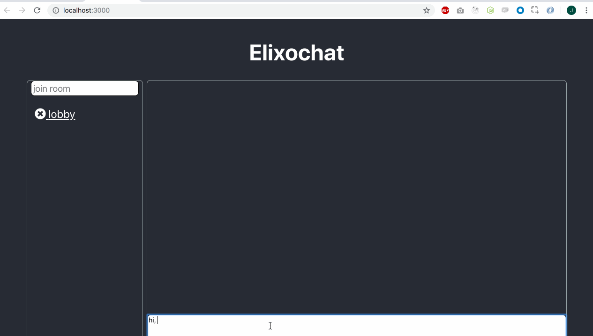

# Elixochat


Elixochat is a small web chat application. Users can connect to a common lobby and chat with other users.
Elixochat also supports "private" rooms. Those "private" rooms can only be joined by users that know the name of the room.

## Running the app
If you have docker and docker-compose installed, just run:
```
$ docker-compose up
```

then, visit: [localhost](http://localhost)

## Motivations
I'm currently learning Phoenix and all things related to Elixir and Erlang/OTP. I also love chats, so I decided to build one.

## Technologies
The frontend is a standard create-react-app app.
I used [Phoenix](https://phoenixframework.org/) to build the backend.
